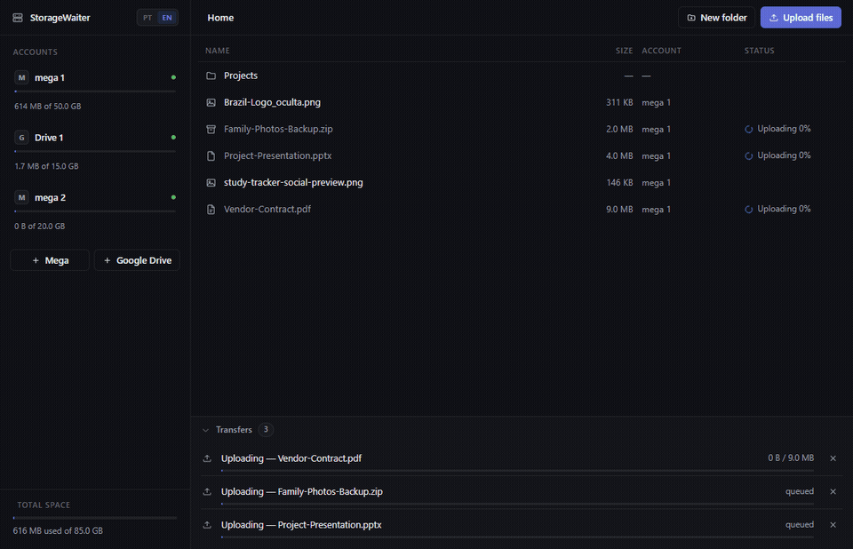
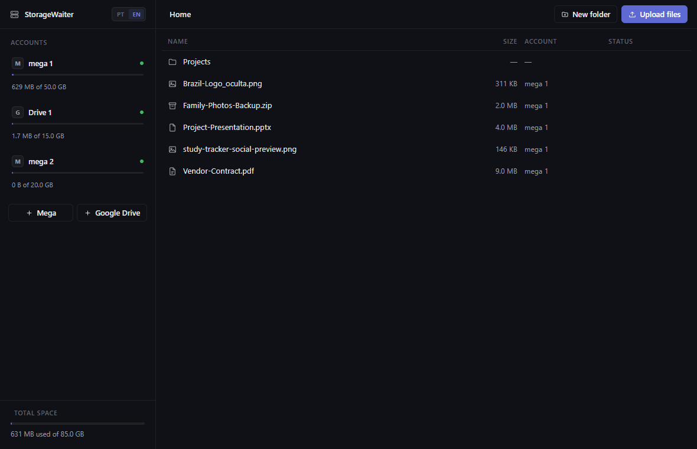
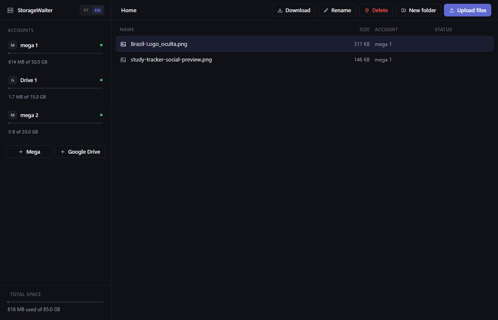
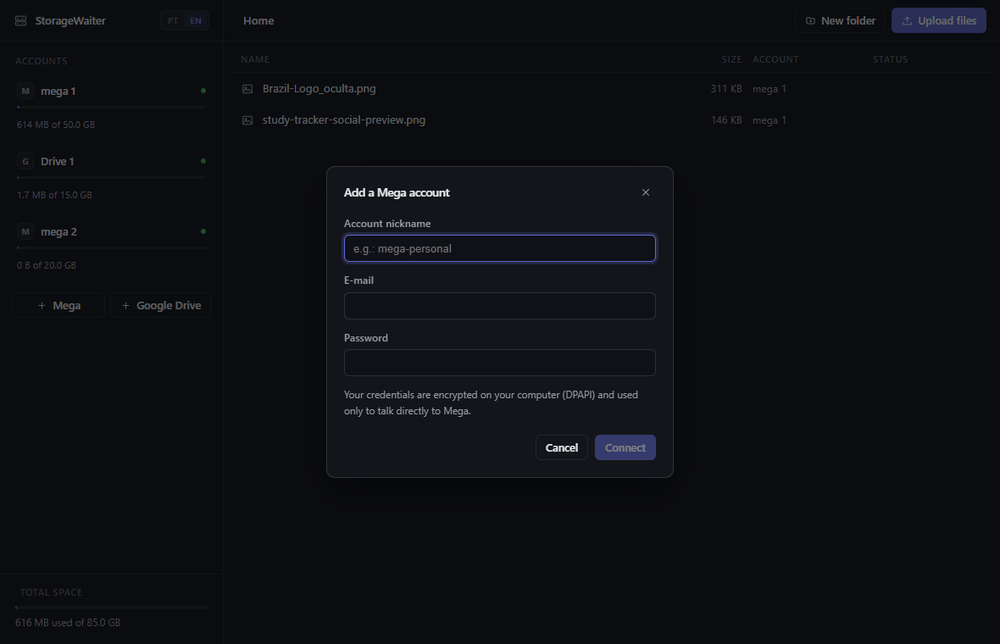
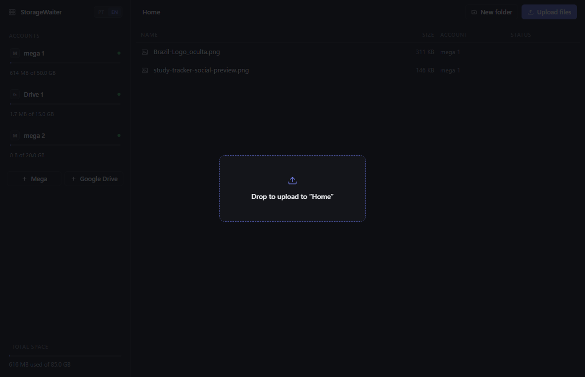
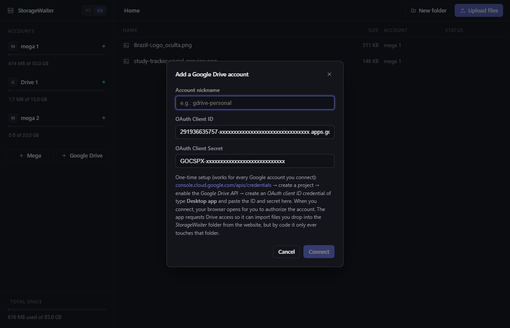
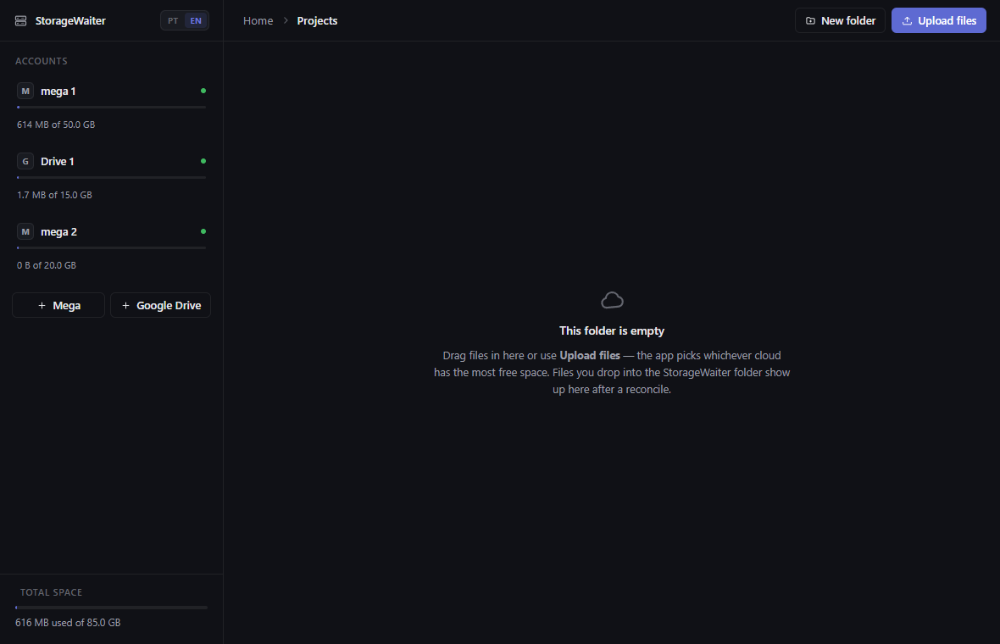

<div align="center">


# StorageWaiter

**A local-first desktop app that pools the free cloud storage accounts you already have (Mega, Google Drive) into one virtual drive — drop a file in, it lands wherever has the most free space, and comes back byte-identical whenever you ask for it.**

[](https://www.electronjs.org/)
[](https://react.dev/)
[](https://www.typescriptlang.org/)
[](https://nodejs.org/api/sqlite.html)
[](https://github.com/pmndrs/zustand)
[](https://vitest.dev/)
[](LICENSE)

**English** · [Português (BR)](README.pt-BR.md)

</div>

> This is a local, single-user desktop app — there is no backend, no telemetry, no account of mine in the loop. The screenshots and GIFs below are the real app, driven against my own real Mega and Google Drive accounts.

---

## Table of contents

- [Screenshots](#screenshots)
- [Why I built this](#why-i-built-this)
- [What it actually does](#what-it-actually-does)
- [Features](#features)
- [Tech stack](#tech-stack)
- [Architecture](#architecture)
- [Engineering decisions worth calling out](#engineering-decisions-worth-calling-out)
- [Security model](#security-model)
- [Project structure](#project-structure)
- [Running it locally](#running-it-locally)
- [Limitations (by design, for now)](#limitations-by-design-for-now)
- [Roadmap](#roadmap)
- [License](#license)

---

## Screenshots

### Drop a file in, watch the waiter place it

Three files dropped at once queue up and upload in parallel-looking order (one active transfer per account, so no two jobs fight over the same account's session or rate limit); each account's meter grows live as bytes land.



### Reconciling an account picks up what changed behind its back

Clicking the reconcile icon re-reads the account's real quota and its `StorageWaiter/` cloud folder, live, while the job shows up in the same transfer queue as any upload or download.


### The app

|                                          Main view                                          |                                        A file selected                                        |
| :----------------------------------------------------------------------------------------------: | :------------------------------------------------------------------------------------------: |
| <br>_Three real accounts (2 Mega, 1 Drive), each with a live free-space meter_ | <br>_Contextual toolbar — download only appears for a ready file_ |

|                                          Adding a cloud account                                          |                                        Drag-and-drop                                        |
| :----------------------------------------------------------------------------------------------: | :------------------------------------------------------------------------------------------: |
| <br>_Mega: just a nickname, e-mail and password_ | <br>_Drop anywhere in the window — it targets whichever folder is open_ |

|                                          Google Drive OAuth                                          |                                        Empty folder                                        |
| :----------------------------------------------------------------------------------------------: | :------------------------------------------------------------------------------------------: |
| <br>_Client ID/secret redacted for this screenshot — everything else is real UI copy_ | <br>_Explains the drag-drop + reconcile-to-import behavior right where you'd need it_ |

_The interface ships in Portuguese and English, switchable from a toggle in the sidebar — I built it in Portuguese for my own daily use first, and these screenshots use the English mode. Screenshots and GIFs above are the real app, uploading real (throwaway, generic-content) files to my own connected accounts, then deleting them again once captured._

---

## Why I built this

I had a handful of free-tier cloud accounts scattered around — a Mega account here, a Google Drive there — each with a few GB nobody was using efficiently because nothing treated them as one pool. I wanted to drop a file _somewhere_ and stop thinking about which "somewhere" that was, while keeping the arrangement 100% free: no subscription, no paid tier, just the sum of accounts I already had.

It's also a small, complete showcase of a production-shaped Electron app that happens to talk to two very different, uncooperative third-party APIs at once:

- a storage-allocation policy that's race-free **without** an advisory lock table — free space is computed by subtracting every still-live job's reservation, inside the same transaction that creates the job;
- crash recovery proven by an actual test that closes the app mid-upload and rebuilds it from scratch over the same on-disk state, not a mock;
- two OAuth/session models (password-based Mega, refresh-token Google) behind one provider interface, each with its own rate-limit and scope gotchas learned the hard way; and
- a virtual file tree that's already modeled as chunks today, on purpose, so that splitting a large file across multiple clouds later needs zero schema migration.

## What it actually does

1. You connect one or more Mega and/or Google Drive accounts. Each account gets its own private `StorageWaiter/` folder in your real cloud — the app never touches anything outside it.
2. You drag files into the app (or use **Enviar arquivos**). For each file, the "waiter" (`choosePlacement`) picks whichever **active** account currently has the most effective free space — real free space minus what every other in-flight upload has already reserved — and reserves headroom on top of the file's size before committing to it.
3. The file is staged locally, hashed (SHA-256), uploaded to the chosen account's `StorageWaiter/` folder under its real name, and tracked in a local SQLite index as a virtual file that *looks* like it lives in one drive.
4. Double-clicking a file downloads it (if not already cached, verifying its hash) into your real Downloads folder and opens it with your OS's default program. Deleting a file removes it from the cloud too.
5. If the app crashes or is closed mid-transfer, the next launch resets any job that was still `running` back to `queued` and picks up right where it left off — proven by a test that does exactly that.
6. Reconciling an account re-reads its real quota and folder contents: files you deleted by hand in the cloud UI get flagged `missing_remote` here, and files you dropped into `StorageWaiter/` from the cloud's own website get imported into the app.

---

## Features

### The waiter (storage allocation)
- Picks the **active** account with the most effective free space: `quota_total - quota_used - reserved`, where `reserved` is the live sum of every `queued`/`running` job's `reserved_bytes` for that account.
- Reserves `max(200 MiB, 2% of file size)` of headroom beyond the literal file size, so a placement decision doesn't get invalidated by quota drifting slightly before the upload finishes.
- The reservation is written in the **same database transaction** as the placement decision, so two files dropped at the same instant can never both "see" the same free space and collide on one account.
- Throws a typed `InsufficientSpaceError` when nothing fits — no file, no orphaned database row.

### Resilience
- Persistent job queue (SQLite-backed) survives app restarts: on boot, any job still marked `running` (meaning the process died mid-transfer) is reset to `queued` and retried from scratch.
- Exponential backoff on failure (`base × 2^attempts`, default base 5 s) up to 5 attempts before a job is marked permanently `failed` with the underlying error kept for display.
- An expired cloud session doesn't count as a failure: the job is parked (kept `queued`, skipped by the scheduler) until you reconnect the account, then resumes automatically.
- Every download is verified against its stored SHA-256 hash; a corrupted or partial download is never treated as a cache hit.
- One job runs per account at a time (so two transfers never fight over the same provider session or rate limit), with a global concurrency cap across accounts.

### Providers
- **Mega** (via `megajs`): password login, classifies errors into "rate limited" vs. "bad credentials" so a throttled IP doesn't get mistaken for a wrong password.
- **Google Drive** (via `@googleapis/drive` + `google-auth-library`): desktop OAuth with PKCE over a local loopback server, refresh-token rotation handled transparently, and a deliberate full-Drive-scope decision (see below) needed for reconciliation to actually work.
- **Fake** (in-memory, tests only): the same interface, with fault injection (latency, forced failures, expired auth, a provider that "lies" about quota) used to drive the crash-recovery and reconciliation test suites without touching a real network.
- Every provider only ever reads/writes inside its own `StorageWaiter/` folder — by code, not just by convention.

### Reconciliation & the virtual drive
- Reconciling an account is a three-way diff against the real cloud: previously-uploaded files that vanished remotely are flagged `missing_remote` (and deleting them afterwards fires **zero** cloud requests — there's nothing left to delete); files present in the cloud folder but unknown to the app are imported.
- Deleting a folder cancels any of its files still uploading, enqueues cloud-deletion jobs for the rest, and only then removes the local rows — never the other way around.
- Name collisions (two files named the same in one folder) are resolved the same way on upload, folder creation and reconcile-import: `foto.png` → `foto (2).png`.

### Security
- Every account's credentials are encrypted at rest via Electron's `safeStorage` (Windows DPAPI under the hood) — the encrypted blob is tied to your Windows user account and useless if copied elsewhere.
- `contextIsolation` on, `nodeIntegration` off, and a `setWindowOpenHandler` that always routes links to your real browser instead of opening an in-app popup.
- The core engine (`packages/core`) never imports Electron — the app injects the DPAPI cipher, tests inject a plaintext one, so a future headless/CLI runner could inject something else entirely without touching engine code.

### Bilingual interface
- Portuguese and English, switchable live from the sidebar, persisted to `localStorage`. `en.ts` is type-checked against `type Dict = typeof pt` (Portuguese as the source of truth), so the build fails if a key goes missing from either dictionary.
- `packages/core` is UI-agnostic by design and predates i18n, so it still throws fixed Portuguese error strings. Rather than refactor every one of its ~30 throw sites into an error-code contract, the renderer pattern-matches the known, finite set of core/provider messages at the presentation boundary and translates only what it recognizes — anything unrecognized (a raw `megajs`/`googleapis` error, say) is shown exactly as thrown instead of being guessed at.

---

## Tech stack

| | |
|---|---|
| **Electron 43** | Desktop shell — a single BrowserWindow, a typed IPC bridge, zero Node access from the renderer. |
| **React 18 + Zustand 5** | UI and state. No Redux, no react-query — all data flows through a handful of imperative refetches triggered by 3 pushed IPC events. |
| **TypeScript 5.6**, strict, `noUncheckedIndexedAccess` | Across the whole monorepo, engine and UI alike. |
| **`node:sqlite`** (Node's built-in module) | The entire local index — accounts, virtual file tree, file parts, job queue — no native SQLite dependency to compile or ship. |
| **`megajs`** | Mega client — login, upload/download streams, folder operations. |
| **`@googleapis/drive` + `google-auth-library`** | Google Drive API client + OAuth 2.0 (PKCE, loopback flow, refresh-token rotation). |
| **Vitest 3** | The core engine's test suite — 27 tests across allocation, migrations, the upload/download/reconcile pipeline, and literal crash recovery. |
| **electron-vite** | Build tooling for main/preload/renderer, backed by Vite 6. |

No ORM: `node:sqlite` is used directly with hand-written SQL and a small custom migration runner (see below) — the schema is simple enough that an ORM would be pure overhead.

---

## Architecture

`packages/core` is a plain Node package with **zero Electron imports** — it's testable in complete isolation and could in principle drive a CLI or a headless sync daemon instead of a GUI. `packages/app` is the Electron shell around it.

```
                                RENDERER (React + Zustand)
                                          │
                                window.core.*  (contextBridge, ~20 methods)
                                          │
                                 PRELOAD (context-isolated)
                                          │
                          ipcRenderer.invoke('core:<method>' | 'app:<method>')
                                          │
                    ┌─────────────────────▼──────────────────────┐
                    │              MAIN PROCESS                    │
                    │   ipc-bridge.ts: 19 invoke channels 1:1 onto  │
                    │   CoreService methods, + 3 pushed events      │
                    └─────────────────────┬──────────────────────┘
                                          │
                    ┌─────────────────────▼──────────────────────┐
                    │             CoreService (packages/core)       │
                    │   UI-agnostic facade · EventEmitter            │
                    └───┬─────────────┬─────────────┬─────────────┘
                        │             │             │
                 ┌──────▼─────┐ ┌─────▼──────┐ ┌────▼─────────┐
                 │  db (SQLite)│ │   engine   │ │  vfs (tree)   │
                 │  accounts,  │ │  waiter +  │ │  folders,     │
                 │  nodes,     │ │  job queue │ │  rename,      │
                 │  file_parts,│ │  + session │ │  unique names │
                 │  jobs       │ │  manager   │ │               │
                 └─────────────┘ └─────┬──────┘ └───────────────┘
                                       │
                        ┌──────────────┼───────────────┐
                        ▼              ▼               ▼
                  MegaProvider   GDriveProvider    FakeProvider
                  (megajs)       (googleapis +     (in-memory,
                                  google-auth)      tests only)
```

Credentials cross one more boundary before they ever reach `db`: the app injects a `SafeStorageCipher` (Electron `safeStorage` / Windows DPAPI); tests inject a `PlaintextCipher`. Core only ever sees the `SecretCipher` interface.

---

## Engineering decisions worth calling out

**Race-free storage allocation without a lock table.** Two files dropped at the same instant both ask "which account has the most free space?" `choosePlacement` answers that by subtracting the **live sum of every `queued`/`running` job's `reserved_bytes`** from each account's real free space — and the job row that makes that reservation stick is inserted in the *same* `BEGIN IMMEDIATE` transaction as the placement query. SQLite serializes that transaction for you, so the second file's query can never see stale free space. No advisory locks, no separate reservation table — just one transaction doing both the read and the write that has to stay consistent with it.

**Crash recovery proven by actually simulating a crash.** `JobQueue.start()` resets any job still marked `running` back to `queued` on boot — the theory being that `running` only means "was in flight when the process died." The test for this doesn't mock anything: it starts an upload with artificial latency, waits until the job is provably `running` in the database, then closes the whole `CoreService` and constructs a **brand-new one** over the same SQLite file, staging directory and in-memory fake cloud — the closest thing to an actual process kill you can do in-process — and asserts the file finishes uploading correctly afterward.

**`drive.file` looked like the "safe" OAuth scope. It would have silently broken reconciliation.** Google's `drive.file` scope only grants access to files the app itself created — which sounds like least-privilege best practice, until you remember reconciliation exists specifically to **see files the user dropped into the `StorageWaiter/` folder from Google Drive's own website**, which `drive.file` makes invisible. The app requests the full `drive` scope instead, offset by two things: each user brings their own OAuth client (no shared app, so no Google verification review gate to worry about), and the app only ever touches the `StorageWaiter/` folder *by code*, regardless of what the scope would technically allow.

**A token can go stale in scope, not just in time.** Reconnecting or upgrading an account calls `getTokenInfo()` and checks that the live token actually carries the `drive` scope — because a token minted before a scope change would keep "working" for uploads while silently being unable to see reconcile-imported files, a failure mode that wouldn't throw anywhere, just quietly do less than expected.

**Never log in twice where one login is enough.** Mega rate-limits logins per IP. `authorize()` for a new Mega account deliberately does **not** log in — it just captures the email/password — because `connect()` runs immediately afterward and would otherwise trigger a second login in the same breath. The same throttling concern is why startup account verification only re-checks each account at most once per `verifyIntervalMs` (15 minutes by default): probing every account on every dev restart is exactly the pattern that gets an IP temporarily blocked.

**A migration runner that's plain TypeScript, on purpose.** `node:sqlite` ships no migration helper, and the migrations themselves are template-string constants rather than `.sql` files — specifically so they survive being bundled into the Electron main process without needing separate asset-copying rules. The runner itself is a `PRAGMA user_version` loop, each migration wrapped in its own transaction with rollback on failure; idempotency is asserted directly in the test suite by reopening an already-migrated database and confirming nothing tries to recreate an existing table.

**Deleting something that's already gone is success, not an error.** Every provider's `delete()` is contractually idempotent, because a local session can legitimately lag behind the real cloud (you deleted the file from the Mega app on your phone, and this session doesn't know yet). Reconciliation leans on the same idea: a file already flagged `missing_remote` by a previous reconcile fires **zero** network requests when you delete it locally — there's nothing left to ask the cloud to remove.

**A shutdown abort is not a cancel.** When the app quits gracefully mid-upload, the in-flight job's `AbortController` fires — but the code deliberately does *not* transition that job to `canceled`. It's left `running` in the database on purpose, so the crash-recovery path (`running` → `queued` on next boot) picks it back up instead of treating a graceful shutdown as if the user had explicitly canceled the transfer.

**A known, acknowledged inconsistency.** The Google OAuth app's own `client_id`/`client_secret` (not the user's Google password — the OAuth *application* registration, entered once in the "Add Google Drive account" dialog) are cached in plaintext in the local `settings` table purely so the dialog can prefill them next time. Every actual credential — Mega passwords, Google refresh tokens — goes through DPAPI encryption first. This one plaintext convenience value is a deliberate, narrow exception I'm calling out rather than hiding.

---

## Security model

| Layer | How it's enforced |
|---|---|
| **Credentials at rest** | Encrypted via Electron `safeStorage` (Windows DPAPI) before ever reaching SQLite; tied to the local Windows user account. |
| **Renderer isolation** | `contextIsolation: true`, `nodeIntegration: false`; the renderer's only bridge to the outside world is the explicit `window.core` API exposed via `contextBridge`. |
| **External links** | `setWindowOpenHandler` denies every in-app popup and routes to the system browser instead — nothing ever loads inside the app that isn't the app's own UI. |
| **Cloud scope** | Every provider is coded to touch only its own `StorageWaiter/` folder, regardless of what the granted OAuth scope would technically allow. |
| **Engine/runtime boundary** | `packages/core` never imports Electron; it receives a `SecretCipher` and an `openUrl` callback from whoever hosts it, so the DPAPI dependency is entirely the app layer's problem. |
| **Known tradeoff** | The Google OAuth app's own client ID/secret (not user credentials) are cached in plaintext for dialog prefill — see [above](#engineering-decisions-worth-calling-out). |

---

## Project structure

```
storage-waiter/
├── packages/
│   ├── core/                     # pure Node engine — zero Electron imports
│   │   ├── src/
│   │   │   ├── db/                # node:sqlite + custom migration runner
│   │   │   │   └── migrations/    # 001_init, 002_job_payload, 003_account_verified_at
│   │   │   ├── engine/
│   │   │   │   ├── waiter.ts       # choosePlacement + headroom — the allocation policy
│   │   │   │   ├── job-queue.ts    # retry/backoff, crash recovery, concurrency
│   │   │   │   └── session-manager.ts
│   │   │   ├── providers/
│   │   │   │   ├── mega/
│   │   │   │   ├── gdrive/         # OAuth loopback flow, scope handling
│   │   │   │   └── fake/           # in-memory test double
│   │   │   ├── security/           # SecretCipher interface
│   │   │   ├── vfs/                 # virtual folder tree operations
│   │   │   ├── core-service.ts      # the public facade the app talks to
│   │   │   └── api-types.ts         # DTOs crossing the IPC boundary
│   │   └── test/                    # migrations, pipeline, recovery, waiter — 27 tests
│   │
│   └── app/                       # Electron shell
│       └── src/
│           ├── main/               # window, IPC bridge, SafeStorageCipher (DPAPI)
│           ├── preload/            # contextBridge → window.core
│           └── renderer/           # React + Zustand UI (pt/en)
│               └── src/
│                   ├── i18n/        # pt.ts (source of truth), en.ts (type-checked mirror)
│                   └── components/  # Sidebar, FileGrid, TransferQueue, Modals
│
├── docs/screenshots/                # everything embedded above in this README
└── docs/social-preview.png
```

---

## Running it locally

```bash
npm install
npm run dev        # opens the app in development mode
npm test           # the core engine's suite, against an in-memory fake provider
npm run build      # production bundle in packages/app/out
npm run typecheck  # tsc --noEmit across core and app
```

Requires **Node.js 22+** (the engine uses the built-in `node:sqlite` module — no native dependency to compile).

### Connecting your own clouds

**Mega (easiest — 20 GB free per account).** Click **+ Mega**, enter the account's e-mail and password.

**Google Drive (15 GB free per account).** Google requires desktop apps to bring their own OAuth credential — a one-time, free setup that then works for every Google account you connect:

1. Go to [console.cloud.google.com/apis/credentials](https://console.cloud.google.com/apis/credentials) and create a project (any name).
2. Under **APIs & Services → Library**, enable the **Google Drive API**.
3. Under **OAuth consent screen**, configure it as **External** and add your own e-mail as a test user.
4. Under **Credentials → Create credentials → OAuth client ID**, choose **Desktop app**.
5. Paste the **Client ID** and **Client Secret** into the app's **+ Google Drive** dialog.

Your browser opens to authorize the account. The app requests the full Drive scope — necessary for reconciliation to see files you drop into the `StorageWaiter/` folder from the website (`drive.file` would hide them) — but only ever reads or writes inside that one folder, by code. If you connected an account before this scope existed, click **↻** on it to reauthorize.

---

## Limitations (by design, for now)

- A file can't be larger than your biggest single account's free space — chunking a file across multiple clouds is modeled in the schema (`file_parts`) but not implemented yet.
- Opened files are read-only copies in the local cache; editing the copy doesn't sync back to the cloud (bidirectional sync is a v2 idea).
- The index lives on this machine only — there's no cross-device sync of the index itself (though nothing stops you from manually copying the SQLite file).
- There's no move/drag-into-folder operation in the UI yet — files can be renamed and deleted, but not reparented.

## Roadmap

- [ ] Chunk large files across multiple accounts (the `file_parts` table already models this — no schema migration needed when it lands)
- [ ] Bidirectional sync for opened/edited files
- [ ] Move/reparent files and folders in the UI
- [ ] macOS/Linux builds (DPAPI-based credential encryption is Windows-only today; another platform needs a different `SecretCipher` implementation)
- [ ] Automated end-to-end tests for the Electron shell itself (today's 27 tests cover the engine; the UI is verified manually)

---

## License

Released under the [MIT License](LICENSE) — © 2026 Luis Eduardo.

<div align="center">

Built solo by [@merino626](https://github.com/merino626).

</div>
