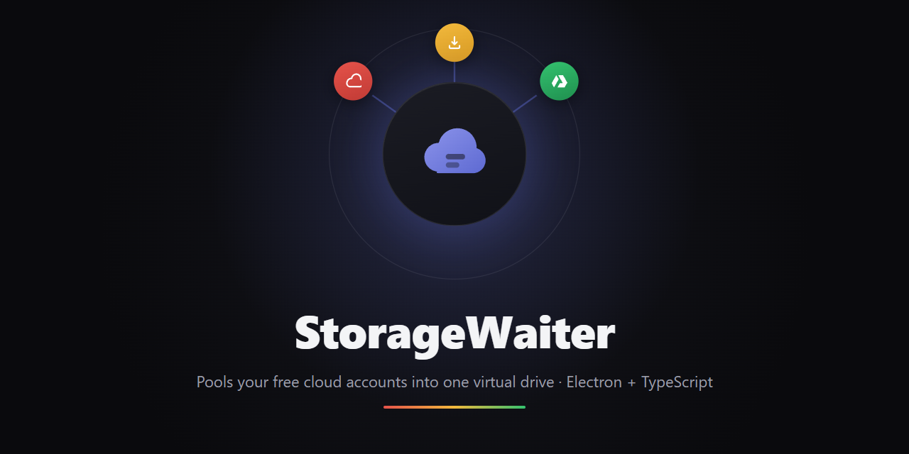
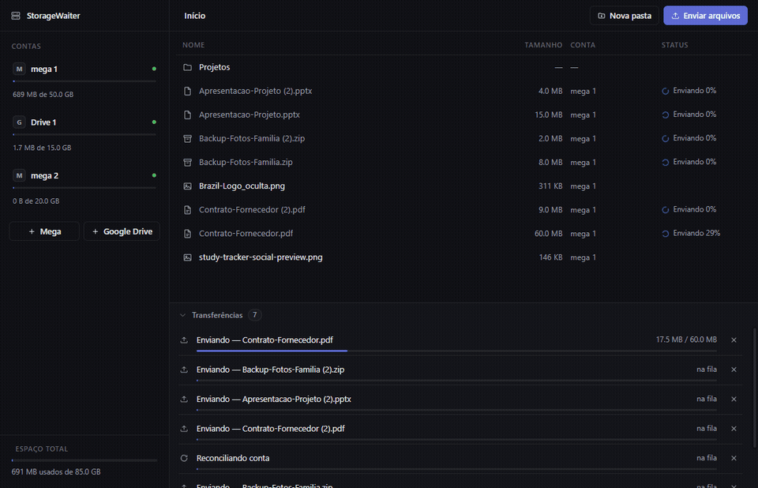
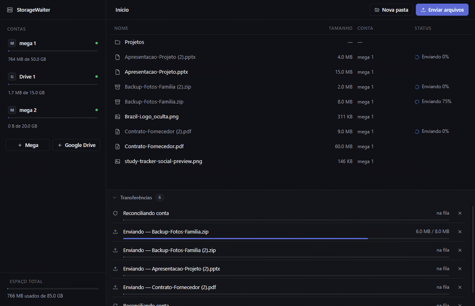
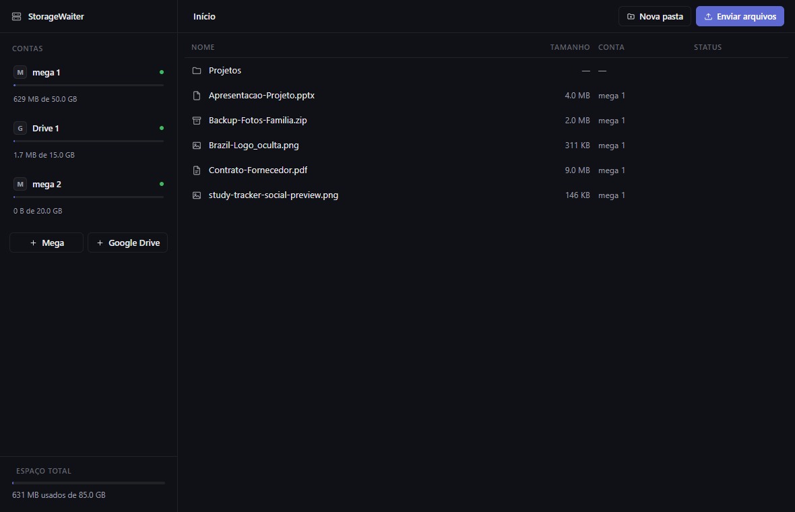
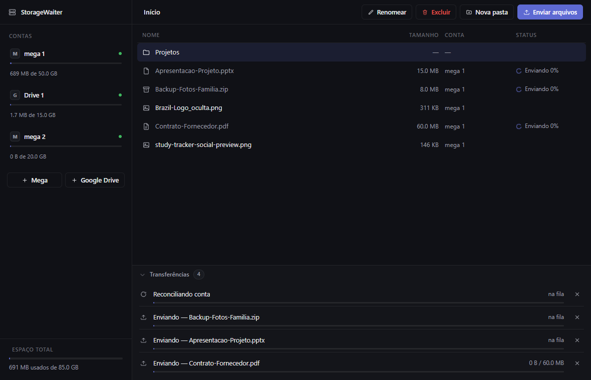
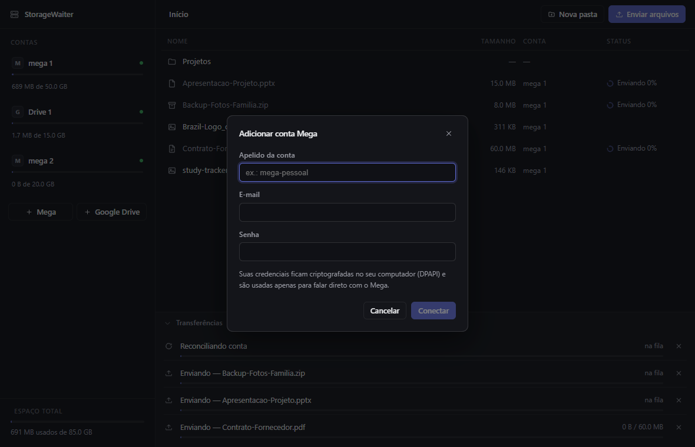
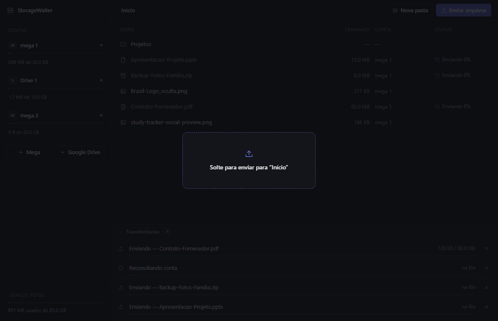
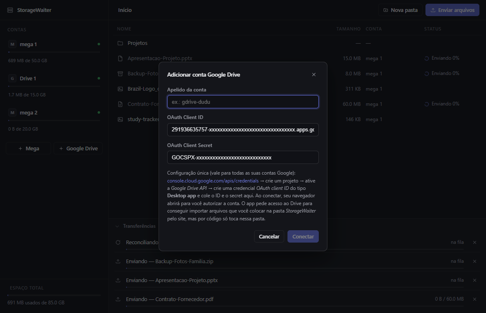
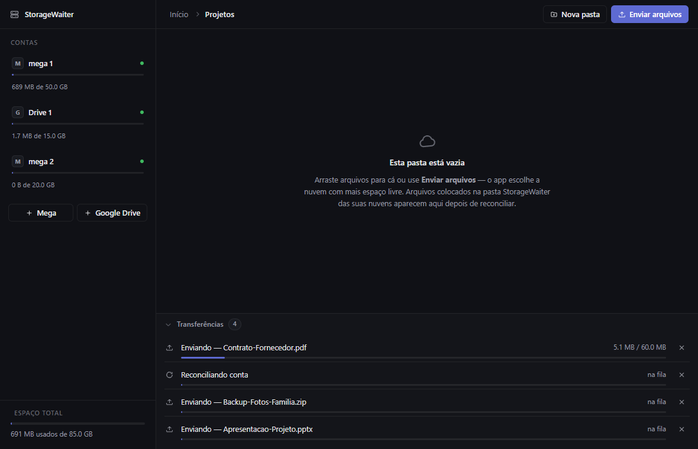

<div align="center">



# StorageWaiter

**Um app de desktop local-first que junta as contas de nuvem grátis que você já tem (Mega, Google Drive) em um único drive virtual — arraste um arquivo, ele cai na conta com mais espaço livre, e volta idêntico sempre que você pedir.**

[](https://www.electronjs.org/)
[](https://react.dev/)
[](https://www.typescriptlang.org/)
[](https://nodejs.org/api/sqlite.html)
[](https://github.com/pmndrs/zustand)
[](https://vitest.dev/)
[](LICENSE)

[English](README.md) · **Português (BR)**

</div>

> Este é um app local, de usuário único — não existe backend, telemetria, ou qualquer conta minha no meio. Os screenshots e GIFs abaixo são do app de verdade, rodando contra minhas próprias contas reais de Mega e Google Drive.

---

## Sumário

- [Screenshots](#screenshots)
- [Por que eu construí isso](#por-que-eu-construí-isso)
- [O que o app realmente faz](#o-que-o-app-realmente-faz)
- [Funcionalidades](#funcionalidades)
- [Stack técnica](#stack-técnica)
- [Arquitetura](#arquitetura)
- [Decisões de engenharia que valem a pena destacar](#decisões-de-engenharia-que-valem-a-pena-destacar)
- [Modelo de segurança](#modelo-de-segurança)
- [Estrutura do projeto](#estrutura-do-projeto)
- [Rodando localmente](#rodando-localmente)
- [Limitações (por design, por enquanto)](#limitações-por-design-por-enquanto)
- [Roadmap](#roadmap)
- [Licença](#licença)

---

## Screenshots

### Solte um arquivo, veja o garçom escolher a conta

Três arquivos soltos de uma vez entram na fila e sobem em ordem (uma transferência ativa por conta, para que dois jobs nunca disputem a mesma sessão ou o mesmo rate limit); o medidor de cada conta cresce ao vivo conforme os bytes chegam.



### Reconciliar uma conta detecta o que mudou por fora

Clicar no ícone de reconciliar relê a quota real da conta e a pasta `StorageWaiter/` na nuvem, ao vivo, com o job aparecendo na mesma fila de transferências de qualquer envio ou download.



### O app

|                                          Tela principal                                          |                                        Um arquivo selecionado                                        |
| :----------------------------------------------------------------------------------------------: | :------------------------------------------------------------------------------------------: |
| <br>_Três contas reais (2 Mega, 1 Drive), cada uma com medidor de espaço livre ao vivo_ | <br>_Barra de ações contextual — baixar só aparece para um arquivo pronto_ |

|                                          Adicionando uma conta de nuvem                                          |                                        Arrastar e soltar                                        |
| :----------------------------------------------------------------------------------------------: | :------------------------------------------------------------------------------------------: |
| <br>_Mega: só um apelido, e-mail e senha_ | <br>_Solte em qualquer lugar da janela — vai para a pasta que estiver aberta_ |

|                                          OAuth do Google Drive                                          |                                        Pasta vazia                                        |
| :----------------------------------------------------------------------------------------------: | :------------------------------------------------------------------------------------------: |
| <br>_Client ID/secret ocultados neste print — o resto é a interface real_ | <br>_Explica o drag-drop e o import via reconciliação bem onde você precisaria disso_ |

_A interface tem português e inglês, trocáveis ao vivo por um botão na sidebar — construí em português para meu próprio uso diário primeiro, e os screenshots acima usam o modo em português. Os screenshots e GIFs são do app de verdade, enviando arquivos reais (descartáveis, de conteúdo genérico) para minhas próprias contas conectadas, apagados logo depois de capturados._

---

## Por que eu construí isso

Eu tinha várias contas de nuvem grátis espalhadas — uma no Mega, outra no Google Drive — cada uma com alguns GB que ninguém usava direito porque nada tratava aquilo como um espaço só. Eu queria arrastar um arquivo para _algum lugar_ e parar de pensar em qual lugar era esse, mantendo o esquema 100% grátis: sem assinatura, sem plano pago, só a soma das contas que eu já tinha.

Também é uma vitrine pequena e completa de um app Electron com cara de produção que precisa conversar com duas APIs de terceiros bem diferentes e nada cooperativas ao mesmo tempo:

- uma política de alocação de espaço livre de race conditions **sem** uma tabela de locks — o espaço livre é calculado subtraindo a reserva de todo job ainda vivo, dentro da mesma transação que cria o job;
- recuperação de crash comprovada por um teste de verdade, que fecha o app no meio de um envio e reconstrói tudo do zero sobre o mesmo estado em disco, não um mock;
- dois modelos de autenticação (senha no Mega, refresh token no Google) atrás de uma única interface de provider, cada um com suas próprias pegadinhas de rate limit e escopo aprendidas na prática; e
- uma árvore de arquivos virtual já modelada em pedaços (chunks) hoje, de propósito, para que fatiar um arquivo grande entre nuvens no futuro não precise de nenhuma migração de schema.

## O que o app realmente faz

1. Você conecta uma ou mais contas Mega e/ou Google Drive. Cada conta ganha sua própria pasta privada `StorageWaiter/` na nuvem real — o app nunca toca em nada fora dela.
2. Você arrasta arquivos para o app (ou usa **Enviar arquivos**). Para cada arquivo, o "garçom" (`choosePlacement`) escolhe a conta **ativa** com mais espaço livre efetivo no momento — espaço livre real menos o que todo outro envio em andamento já reservou — e reserva uma margem extra além do tamanho do arquivo antes de se comprometer com a escolha.
3. O arquivo é copiado localmente (staging), tem seu hash calculado (SHA-256), é enviado para a pasta `StorageWaiter/` da conta escolhida com o nome real, e fica registrado num índice SQLite local como um arquivo virtual que *parece* morar em um único drive.
4. Dar duplo clique num arquivo baixa ele (se ainda não estiver em cache, verificando o hash) para sua pasta Downloads real e abre com o programa padrão do sistema. Excluir um arquivo remove da nuvem também.
5. Se o app travar ou for fechado no meio de uma transferência, a próxima abertura reseta qualquer job que ainda estava `running` de volta para `queued` e retoma exatamente de onde parou — comprovado por um teste que faz exatamente isso.
6. Reconciliar uma conta relê a quota real e o conteúdo da pasta na nuvem: arquivos que você apagou na mão pela interface da nuvem ficam marcados como `missing_remote` aqui, e arquivos que você colocou na pasta `StorageWaiter/` pelo site da nuvem são importados para o app.

---

## Funcionalidades

### O garçom (alocação de espaço)
- Escolhe a conta **ativa** com mais espaço livre efetivo: `quota_total - quota_used - reservado`, onde `reservado` é a soma ao vivo de `reserved_bytes` de todo job `queued`/`running` daquela conta.
- Reserva `max(200 MiB, 2% do tamanho do arquivo)` de margem além do tamanho literal do arquivo, para que a decisão de alocação não seja invalidada por uma pequena variação de quota antes do envio terminar.
- A reserva é escrita na **mesma transação de banco** que a decisão de alocação, então dois arquivos soltos no mesmo instante nunca conseguem "ver" o mesmo espaço livre e colidir na mesma conta.
- Lança um `InsufficientSpaceError` tipado quando nada cabe — sem arquivo, sem linha órfã no banco.

### Resiliência
- Fila de jobs persistente (em SQLite) sobrevive a reinícios do app: ao abrir, todo job ainda marcado `running` (ou seja, o processo morreu no meio da transferência) é resetado para `queued` e tentado de novo do zero.
- Backoff exponencial em falhas (`base × 2^tentativas`, base padrão de 5 s) até 5 tentativas antes do job ser marcado `failed` permanentemente, com o erro original guardado para exibição.
- Uma sessão de nuvem expirada não conta como falha: o job fica estacionado (`queued`, ignorado pelo agendador) até você reconectar a conta, e então retoma sozinho.
- Todo download é verificado contra o hash SHA-256 armazenado; um download corrompido ou parcial nunca é tratado como cache válido.
- Um job por conta por vez (para que duas transferências nunca disputem a mesma sessão do provider ou o mesmo rate limit), com um limite global de concorrência entre contas.

### Providers
- **Mega** (via `megajs`): login por senha, classificando erros entre "rate limit" e "credencial errada" para que um IP temporariamente bloqueado não seja confundido com senha incorreta.
- **Google Drive** (via `@googleapis/drive` + `google-auth-library`): OAuth de desktop com PKCE sobre um servidor loopback local, rotação de refresh token tratada de forma transparente, e uma decisão deliberada de usar o escopo completo do Drive (veja abaixo) necessária para a reconciliação funcionar de verdade.
- **Fake** (em memória, só para testes): a mesma interface, com injeção de falhas (latência, falhas forçadas, autenticação expirada, um provider que "mente" sobre a quota) usada para rodar os testes de recuperação de crash e reconciliação sem tocar em rede real.
- Cada provider só lê/escreve dentro da própria pasta `StorageWaiter/` — por código, não só por convenção.

### Reconciliação e o drive virtual
- Reconciliar uma conta é um diff de três vias contra a nuvem real: arquivos já enviados que sumiram remotamente ficam marcados `missing_remote` (e apagá-los depois disso dispara **zero** requisições à nuvem — não sobrou nada para apagar); arquivos presentes na pasta da nuvem mas desconhecidos do app são importados.
- Excluir uma pasta cancela os arquivos dela que ainda estão subindo, enfileira jobs de exclusão na nuvem para o resto, e só depois remove as linhas locais — nunca na ordem inversa.
- Colisões de nome (dois arquivos com o mesmo nome na mesma pasta) são resolvidas do mesmo jeito no envio, na criação de pasta e no import por reconciliação: `foto.png` → `foto (2).png`.

### Segurança
- As credenciais de cada conta são criptografadas em repouso via `safeStorage` do Electron (DPAPI do Windows por baixo) — o blob criptografado fica atrelado à sua conta do Windows e é inútil se copiado para outro lugar.
- `contextIsolation` ligado, `nodeIntegration` desligado, e um `setWindowOpenHandler` que sempre manda links para o navegador de verdade em vez de abrir um popup dentro do app.
- O motor central (`packages/core`) nunca importa Electron — o app injeta a cifra DPAPI, os testes injetam uma cifra em texto puro, então um futuro executor headless/CLI poderia injetar outra coisa completamente diferente sem tocar no código do motor.

### Interface bilíngue
- Português e inglês, trocáveis ao vivo pela sidebar, persistidos em `localStorage`. `en.ts` é checado em tempo de compilação contra `type Dict = typeof pt` (português como fonte da verdade), então o build quebra se faltar uma chave em qualquer um dos dois dicionários.
- `packages/core` é agnóstico de UI por design e é anterior ao i18n, então ainda lança mensagens de erro fixas em português (~30 pontos diferentes). Em vez de refatorar cada um desses pontos para um contrato de códigos de erro, o renderer reconhece por regex o conjunto finito de mensagens conhecidas do core/providers na fronteira de apresentação e só traduz o que reconhece — qualquer coisa não reconhecida (um erro cru do `megajs`/`googleapis`, por exemplo) aparece exatamente como foi lançada, em vez de ser adivinhada.

---

## Stack técnica

| | |
|---|---|
| **Electron 43** | Casca de desktop — uma única BrowserWindow, uma ponte IPC tipada, zero acesso a Node no renderer. |
| **React 18 + Zustand 5** | Interface e estado. Sem Redux, sem react-query — os dados fluem por um punhado de refetches imperativos disparados por 3 eventos IPC empurrados do main. |
| **TypeScript 5.6**, strict, `noUncheckedIndexedAccess` | Em todo o monorepo, motor e interface igualmente. |
| **`node:sqlite`** (módulo nativo do Node) | Todo o índice local — contas, árvore de arquivos virtual, partes de arquivo, fila de jobs — sem dependência nativa de SQLite para compilar ou distribuir. |
| **`megajs`** | Cliente Mega — login, streams de upload/download, operações de pasta. |
| **`@googleapis/drive` + `google-auth-library`** | Cliente da API do Google Drive + OAuth 2.0 (PKCE, fluxo loopback, rotação de refresh token). |
| **Vitest 3** | Suíte de testes do motor central — 27 testes cobrindo alocação, migrações, o pipeline de envio/download/reconciliação, e recuperação de crash de verdade. |
| **electron-vite** | Ferramental de build para main/preload/renderer, sobre o Vite 6. |

Sem ORM: `node:sqlite` é usado direto com SQL escrito à mão e um pequeno executor de migrações próprio (veja abaixo) — o schema é simples o suficiente para que um ORM fosse pura sobrecarga.

---

## Arquitetura

`packages/core` é um pacote Node puro com **zero imports de Electron** — testável em isolamento completo, e em princípio poderia rodar por trás de uma CLI ou um daemon de sincronização headless em vez de uma interface gráfica. `packages/app` é a casca Electron ao redor dele.

```
                                RENDERER (React + Zustand)
                                          │
                                window.core.*  (contextBridge, ~20 métodos)
                                          │
                                 PRELOAD (context isolado)
                                          │
                          ipcRenderer.invoke('core:<método>' | 'app:<método>')
                                          │
                    ┌─────────────────────▼──────────────────────┐
                    │              PROCESSO MAIN                    │
                    │   ipc-bridge.ts: 19 canais invoke 1:1 sobre    │
                    │   os métodos do CoreService, + 3 eventos      │
                    │   empurrados                                    │
                    └─────────────────────┬──────────────────────┘
                                          │
                    ┌─────────────────────▼──────────────────────┐
                    │             CoreService (packages/core)       │
                    │   Fachada agnóstica de UI · EventEmitter       │
                    └───┬─────────────┬─────────────┬─────────────┘
                        │             │             │
                 ┌──────▼─────┐ ┌─────▼──────┐ ┌────▼─────────┐
                 │ db (SQLite) │ │   engine   │ │  vfs (árvore) │
                 │ accounts,   │ │ waiter +   │ │  pastas,      │
                 │ nodes,      │ │ fila de    │ │  renomear,    │
                 │ file_parts, │ │ jobs +     │ │  nomes únicos │
                 │ jobs        │ │ sessões    │ │               │
                 └─────────────┘ └─────┬──────┘ └───────────────┘
                                       │
                        ┌──────────────┼───────────────┐
                        ▼              ▼               ▼
                  MegaProvider   GDriveProvider    FakeProvider
                  (megajs)       (googleapis +     (em memória,
                                  google-auth)      só testes)
```

As credenciais atravessam mais uma fronteira antes de chegar ao `db`: o app injeta um `SafeStorageCipher` (Electron `safeStorage` / DPAPI do Windows); os testes injetam um `PlaintextCipher`. O core só conhece a interface `SecretCipher`.

---

## Decisões de engenharia que valem a pena destacar

**Alocação de espaço livre de race conditions sem tabela de locks.** Dois arquivos soltos no mesmo instante perguntam ambos "qual conta tem mais espaço livre?". `choosePlacement` responde subtraindo a **soma ao vivo de `reserved_bytes`** de todo job `queued`/`running` do espaço livre real de cada conta — e a linha de job que torna essa reserva efetiva é inserida na *mesma* transação `BEGIN IMMEDIATE` da consulta de alocação. O SQLite serializa essa transação sozinho, então a consulta do segundo arquivo nunca consegue ver espaço livre desatualizado. Sem locks avulsos, sem tabela de reserva separada — só uma transação fazendo a leitura e a escrita que precisam ficar consistentes entre si.

**Recuperação de crash comprovada simulando um crash de verdade.** `JobQueue.start()` reseta para `queued` todo job que ainda estava `running` ao abrir o app — a teoria sendo que `running` só pode significar "estava em andamento quando o processo morreu". O teste disso não faz mock de nada: inicia um envio com latência artificial, espera até o job estar comprovadamente `running` no banco, e então fecha o `CoreService` inteiro e constrói um **novo do zero** sobre o mesmo arquivo SQLite, mesma pasta de staging e mesma nuvem fake em memória — o mais próximo de matar o processo de verdade que dá para fazer dentro do mesmo processo — e confirma que o arquivo termina de subir corretamente depois disso.

**`drive.file` parecia o escopo OAuth "seguro". Ele teria quebrado a reconciliação silenciosamente.** O escopo `drive.file` do Google só concede acesso a arquivos que o próprio app criou — o que soa como boa prática de menor privilégio, até lembrar que a reconciliação existe especificamente para **ver arquivos que o usuário colocou na pasta `StorageWaiter/` pelo próprio site do Google Drive**, algo que o `drive.file` torna invisível. O app pede o escopo completo `drive` em vez disso, compensado por dois fatores: cada usuário traz sua própria credencial OAuth (sem app compartilhado, então sem barreira de verificação do Google para se preocupar), e o app só toca a pasta `StorageWaiter/` *por código*, independente do que o escopo tecnicamente permitiria.

**Um token pode envelhecer no escopo, não só no tempo.** Reconectar ou atualizar uma conta chama `getTokenInfo()` e confere se o token vigente realmente carrega o escopo `drive` — porque um token emitido antes de uma mudança de escopo continuaria "funcionando" para envios enquanto silenciosamente deixaria de ver arquivos importados por reconciliação, uma falha que não geraria erro nenhum, só faria menos do que o esperado sem avisar.

**Nunca logar duas vezes onde um login basta.** O Mega limita logins por IP. `authorize()` para uma nova conta Mega deliberadamente **não** faz login — só guarda e-mail/senha — porque `connect()` roda logo em seguida e faria um segundo login na mesma respiração. A mesma preocupação com throttling é o motivo de a verificação de contas na abertura do app só checar cada conta no máximo uma vez a cada `verifyIntervalMs` (15 minutos por padrão): testar todas as contas a cada reinício de desenvolvimento é exatamente o padrão que bloqueia um IP temporariamente.

**Um executor de migrações em TypeScript puro, de propósito.** O `node:sqlite` não vem com nenhum helper de migração, e as migrações em si são constantes de template string em vez de arquivos `.sql` — especificamente para sobreviverem ao empacotamento no processo main do Electron sem precisar de regras separadas de cópia de assets. O executor em si é um loop sobre `PRAGMA user_version`, cada migração dentro da própria transação com rollback em caso de falha; a idempotência é verificada diretamente na suíte de testes reabrindo um banco já migrado e confirmando que nada tenta recriar uma tabela existente.

**Apagar algo que já sumiu é sucesso, não erro.** O `delete()` de todo provider é contratualmente idempotente, porque uma sessão local pode legitimamente ficar atrás da nuvem real (você apagou o arquivo pelo app do Mega no celular, e esta sessão ainda não sabe). A reconciliação se apoia na mesma ideia: um arquivo já marcado `missing_remote` por uma reconciliação anterior dispara **zero** requisições de rede quando você o apaga localmente — não sobrou nada para pedir à nuvem que remova.

**Um abort de desligamento não é um cancelamento.** Quando o app fecha graciosamente no meio de um envio, o `AbortController` daquele job dispara — mas o código deliberadamente **não** transiciona o job para `canceled`. Ele fica `running` no banco de propósito, para que o caminho de recuperação de crash (`running` → `queued` na próxima abertura) o retome, em vez de tratar um desligamento gracioso como se o usuário tivesse cancelado a transferência explicitamente.

**Uma inconsistência conhecida e assumida.** O `client_id`/`client_secret` do próprio app OAuth do Google (não a senha do usuário — o cadastro do *aplicativo* OAuth, digitado uma vez no diálogo "Adicionar conta Google Drive") fica em cache em texto puro na tabela local `settings`, só para o diálogo conseguir preencher automaticamente da próxima vez. Toda credencial de verdade — senhas do Mega, refresh tokens do Google — passa pela criptografia DPAPI primeiro. Esse único valor de conveniência em texto puro é uma exceção deliberada e estreita que prefiro destacar a esconder.

---

## Modelo de segurança

| Camada | Como é garantida |
|---|---|
| **Credenciais em repouso** | Criptografadas via `safeStorage` do Electron (DPAPI do Windows) antes de chegar ao SQLite; atreladas à conta local do Windows. |
| **Isolamento do renderer** | `contextIsolation: true`, `nodeIntegration: false`; a única ponte do renderer com o mundo externo é a API `window.core` explícita exposta via `contextBridge`. |
| **Links externos** | `setWindowOpenHandler` nega todo popup dentro do app e manda para o navegador do sistema — nada carrega dentro do app que não seja a própria interface dele. |
| **Escopo na nuvem** | Todo provider é codificado para tocar só na própria pasta `StorageWaiter/`, independente do que o escopo OAuth concedido tecnicamente permitiria. |
| **Fronteira motor/runtime** | `packages/core` nunca importa Electron; recebe um `SecretCipher` e um callback `openUrl` de quem o hospeda, então a dependência de DPAPI é problema só da camada do app. |
| **Tradeoff conhecido** | O client ID/secret do app OAuth do Google (não credenciais do usuário) fica em cache em texto puro para preencher o diálogo — veja [acima](#decisões-de-engenharia-que-valem-a-pena-destacar). |

---

## Estrutura do projeto

```
storage-waiter/
├── packages/
│   ├── core/                     # motor Node puro — zero imports de Electron
│   │   ├── src/
│   │   │   ├── db/                # node:sqlite + executor de migrações próprio
│   │   │   │   └── migrations/    # 001_init, 002_job_payload, 003_account_verified_at
│   │   │   ├── engine/
│   │   │   │   ├── waiter.ts       # choosePlacement + headroom — a política de alocação
│   │   │   │   ├── job-queue.ts    # retry/backoff, recuperação de crash, concorrência
│   │   │   │   └── session-manager.ts
│   │   │   ├── providers/
│   │   │   │   ├── mega/
│   │   │   │   ├── gdrive/         # fluxo OAuth loopback, tratamento de escopo
│   │   │   │   └── fake/           # dublê de teste em memória
│   │   │   ├── security/           # interface SecretCipher
│   │   │   ├── vfs/                 # operações da árvore de pastas virtual
│   │   │   ├── core-service.ts      # a fachada pública que o app usa
│   │   │   └── api-types.ts         # DTOs que atravessam a fronteira IPC
│   │   └── test/                    # migrations, pipeline, recovery, waiter — 27 testes
│   │
│   └── app/                       # casca Electron
│       └── src/
│           ├── main/               # janela, ponte IPC, SafeStorageCipher (DPAPI)
│           ├── preload/            # contextBridge → window.core
│           └── renderer/           # interface React + Zustand (pt/en)
│               └── src/
│                   ├── i18n/        # pt.ts (fonte da verdade), en.ts (espelho checado)
│                   └── components/  # Sidebar, FileGrid, TransferQueue, Modals
│
├── docs/screenshots/                # tudo que está embutido neste README
└── docs/social-preview.png
```

---

## Rodando localmente

```bash
npm install
npm run dev        # abre o app em modo desenvolvimento
npm test           # suíte do motor central, contra um provider fake em memória
npm run build      # bundle de produção em packages/app/out
npm run typecheck  # tsc --noEmit no core e no app
```

Requer **Node.js 22+** (o motor usa o módulo nativo `node:sqlite` — sem dependência nativa para compilar).

### Conectando suas nuvens

**Mega (mais fácil — 20 GB grátis por conta).** Clique em **+ Mega** e informe e-mail e senha da conta.

**Google Drive (15 GB grátis por conta).** O Google exige que apps desktop tenham a própria credencial OAuth — uma configuração única e grátis que depois vale para todas as suas contas Google:

1. Acesse [console.cloud.google.com/apis/credentials](https://console.cloud.google.com/apis/credentials) e crie um projeto (qualquer nome).
2. Em **APIs e serviços → Biblioteca**, ative a **Google Drive API**.
3. Em **Tela de permissão OAuth**, configure como **Externo** e adicione seu e-mail como test user.
4. Em **Credenciais → Criar credencial → ID do cliente OAuth**, escolha o tipo **App para computador (Desktop app)**.
5. Copie o **Client ID** e o **Client Secret** no diálogo **+ Google Drive** do app.

Ao conectar, o navegador abre para você autorizar. O app pede o escopo completo do Drive — necessário para a reconciliação conseguir ver arquivos que você colocar na pasta `StorageWaiter/` pelo site (`drive.file` os deixaria invisíveis) — mas só lê e escreve dentro dessa pasta, por código. Se você conectou uma conta antes dessa mudança, clique em **↻** nela para reautorizar.

---

## Limitações (por design, por enquanto)

- Um arquivo não pode ser maior que o espaço livre da sua maior conta — fatiar um arquivo entre nuvens já está modelado no schema (`file_parts`) mas ainda não implementado.
- Os arquivos abertos são cópias de leitura no cache local; editar a cópia não sincroniza de volta para a nuvem (sync bidirecional é uma ideia de v2).
- O índice vive só nesta máquina — não há sincronização do índice entre dispositivos (embora nada impeça copiar o arquivo SQLite manualmente).
- Ainda não existe mover/arrastar para dentro de pasta na interface — arquivos podem ser renomeados e excluídos, mas não reparentados.

## Roadmap

- [ ] Fatiar arquivos grandes entre várias contas (a tabela `file_parts` já modela isso — sem migração de schema quando for implementado)
- [ ] Sync bidirecional para arquivos abertos/editados
- [ ] Mover/reparentar arquivos e pastas na interface
- [ ] Builds para macOS/Linux (a criptografia de credenciais via DPAPI hoje é exclusiva do Windows; outra plataforma precisa de um `SecretCipher` diferente)
- [ ] Testes automatizados de ponta a ponta para a própria casca Electron (os 27 testes de hoje cobrem o motor; a interface é verificada manualmente)

---

## Licença

Distribuído sob a [Licença MIT](LICENSE) — © 2026 Luis Eduardo.

<div align="center">

Feito sozinho por [@merino626](https://github.com/merino626).

</div>
